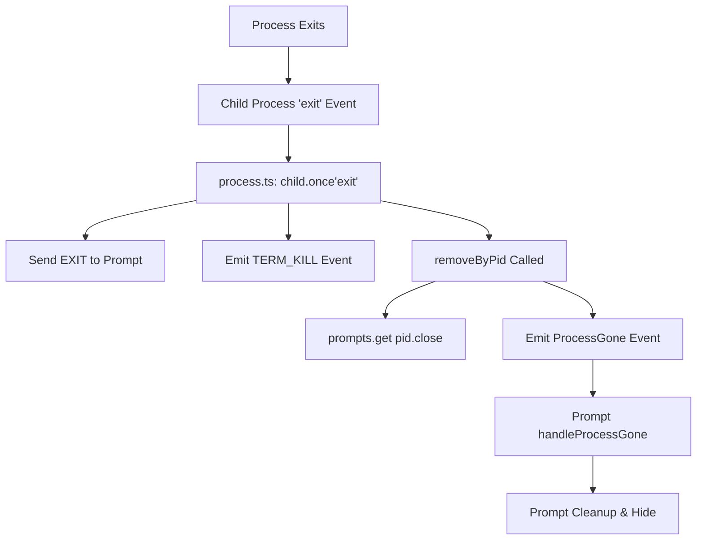
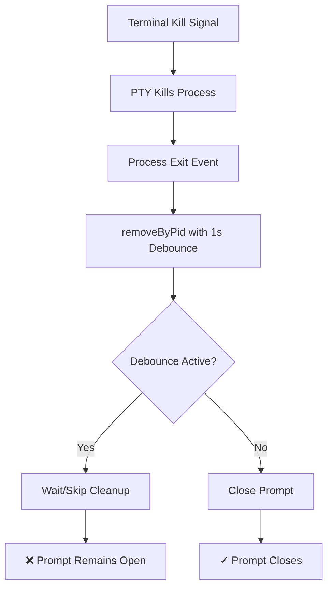

# Prompts and Process Interaction Documentation

## Overview

The Script Kit prompt system manages UI windows that interact with running processes. Each prompt can be bound to a process, creating a coupled lifecycle where process termination should close the associated prompt. However, there are several edge cases where this coupling can break down.

## Architecture

### Core Components

1. **KitPrompt** (`src/main/prompt.ts`)
   - Individual prompt window instances
   - Manages window lifecycle and process binding
   - Handles IPC communication with renderer

2. **Prompts Manager** (`src/main/prompts.ts`)
   - Maintains prompt pool and idle prompt
   - Maps processes to prompts (promptMap)
   - Handles prompt attachment and cleanup

3. **Process Manager** (`src/main/process.ts`)
   - Manages child processes for scripts
   - Handles process lifecycle events
   - Triggers prompt cleanup on process exit

4. **PTY System** (`src/main/pty.ts`)
   - Manages pseudo-terminals for script execution
   - Can kill processes from terminal (Ctrl+C)

## Prompt Lifecycle

### 1. Creation and Initialization

```typescript
// Idle prompt created on startup
const idlePrompt = new KitPrompt(PromptType.idle);

// When script needs a prompt
const prompt = prompts.attachIdlePromptToProcess(reason, pid);
```

### 2. Process Binding

When a prompt is bound to a process:

```typescript
bindToProcess(pid: number) {
    this.pid = pid;
    this.boundToProcess = true;
    this.startLongRunningMonitor();     // 30s check for unresponsive processes
    this.startProcessMonitoring();      // Periodic process alive checks
    this.listenForProcessExit();        // ProcessGone event listener
}
```

### 3. Normal Process Exit Flow



### 4. Terminal Kill Flow (Potential Bug Area)

When a process is killed from terminal (e.g., Ctrl+C in PTY):



## Identified Issues

### 1. **Debounce Race Condition**

**Location**: `src/main/process.ts:removeByPid()`

```typescript
// Problematic debounce mechanism
if (this.pidDebounceMap.has(pid)) {
    log('process.removeByPid already debounced', pid);
    return;
}
this.pidDebounceMap.set(pid, setTimeout(() => {
    this.clearDebounceTimeout(pid);
}, 1000));
```

**Issue**: If multiple cleanup attempts occur within 1 second, subsequent attempts are ignored, potentially leaving prompts open.

### 2. **Early Return in Prompt Close**

**Location**: `src/main/prompt.ts:close()`

```typescript
if (!kitState.allowQuit) {
    if (this.boundToProcess) {
        if (this.hasBeenFocused) {
            // continues with close
        } else {
            this.resetState();
            return; // ❌ Early return prevents cleanup!
        }
    }
}
```

**Issue**: Unfocused prompts might not close properly when their process exits.

### 3. **Process Monitoring Delay**

**Location**: `src/main/prompt.ts:startProcessMonitoring()`

```typescript
setTimeout(() => {
    if (this.boundToProcess && this.pid) {
        this.processMonitorTimer = setInterval(() => {
            this.checkProcessAlive();
        }, this.processCheckInterval);
    }
}, 3000); // 3 second delay before monitoring starts
```

**Issue**: Processes killed within the first 3 seconds might not trigger prompt cleanup.

### 4. **Event Propagation Failures**

The event-based cleanup relies on:
1. Process exit → `removeByPid()` → `prompt.close()`
2. `ProcessGone` event → `prompt.handleProcessGone()`

If either path fails (due to timing, debouncing, or early returns), the prompt remains open.

## Bug Scenario: Terminal Kill Not Closing Prompt

### Reproduction Steps:
1. Script starts with associated prompt
2. User kills process via terminal (Ctrl+C in PTY)
3. Process exits successfully
4. Prompt remains visible/open

### Root Causes:
1. **Debounce prevents immediate cleanup** - The 1-second debounce in `removeByPid()` can block cleanup
2. **Early return in close()** - Unfocused prompts skip cleanup
3. **Event timing issues** - `ProcessGone` event might not reach prompt if it's already partially cleaned
4. **Hide cooldown** - The `hideInstantCoolingDown` flag might prevent hiding

## Process States and Prompt Visibility

| Process State | Expected Prompt State | Actual State (Bug) | Cause |
|--------------|----------------------|-------------------|--------|
| Running | Visible/Hidden based on interaction | ✓ Works | - |
| Exiting normally | Closing/Hiding | ✓ Works | - |
| Killed from terminal | Should close immediately | ❌ May remain open | Debounce/timing |
| Crashed | Should close after detection | ❌ May remain open | 3s monitoring delay |
| Zombie process | Should close after 30s | ✓ Works | Long-running monitor |

## Cleanup Mechanisms

### 1. **Direct Cleanup** (Most Reliable)
```typescript
// In process.removeByPid()
prompts.get(pid)?.close('process.removeByPid');
```

### 2. **Event-Based Cleanup** (Can Fail)
```typescript
// ProcessGone event listener in prompt
emitter.once(KitEvent.ProcessGone, () => {
    this.handleProcessGone();
});
```

### 3. **Periodic Monitors** (Backup)
- **Process Monitor**: Checks every 5s if process is alive
- **Long-Running Monitor**: Checks every 30s for zombie processes

## Recommendations for Fix

### 1. **Remove or Reduce Debounce for Terminal Kills**
```typescript
// In removeByPid()
const isTerminalKill = reason.includes('TERM_KILL');
if (!isTerminalKill && this.pidDebounceMap.has(pid)) {
    return;
}
```

### 2. **Force Close on Process Exit**
```typescript
// Add direct cleanup call
const prompt = prompts.get(pid);
if (prompt && !prompt.isDestroyed()) {
    prompt.handleProcessGone(); // Direct call
    prompt.close('process-exit-forced');
}
```

### 3. **Remove Early Returns in Critical Paths**
```typescript
// In prompt.close()
if (reason.includes('process-exit') || reason.includes('TERM_KILL')) {
    // Skip all guards for process termination
    this.forceClose();
    return;
}
```

### 4. **Add Process State Verification**
```typescript
// Before showing prompt
if (this.boundToProcess && this.pid) {
    const alive = await isProcessAlive(this.pid);
    if (!alive) {
        this.close('process-already-dead');
        return;
    }
}
```

## Testing the Bug

### To Reproduce:
1. Start a long-running script that shows a prompt
2. Open terminal view in the prompt
3. Press Ctrl+C to kill the process
4. Observe if prompt closes properly

### Expected Behavior:
- Process terminates immediately
- Prompt hides and closes within 100ms
- No orphaned prompt windows

### Actual Behavior (Bug):
- Process terminates
- Prompt may remain visible
- Prompt window stays in memory until manually closed

## Logging and Debugging

Enable debug logging to trace the issue:

```bash
# Check these log files
~/Library/Logs/ScriptKit/main.log    # General prompt lifecycle
~/Library/Logs/ScriptKit/process.log # Process termination events
~/Library/Logs/ScriptKit/term.log    # Terminal kill signals
```

Key log messages to look for:
- `"process.removeByPid already debounced"` - Indicates debounce blocking
- `"Prompt close prevented"` - Early return in close()
- `"Process gone but prompt still bound"` - Cleanup failure
- `"hideInstantCoolingDown"` - Hide prevention

## Conclusion

The main issue appears to be a combination of:
1. Overly aggressive debouncing in process cleanup
2. Early returns that prevent cleanup in edge cases
3. Reliance on event propagation that can fail due to timing

The fix requires making the cleanup path more direct and removing obstacles (debounce, early returns, cooldowns) when a process is definitively terminated, especially from terminal kills.