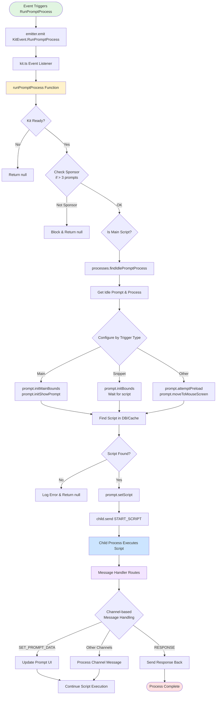

# Run Prompt Process Flow

This diagram illustrates how Script Kit's run prompt process works, from event emission through script execution.

## Key Components Explained

### 1. Event Emission
- Various parts of the app emit `KitEvent.RunPromptProcess` (error handlers, shortcuts, tray menu, watchers, etc.)
- The event includes scriptPath, args, and options (force, trigger type, cwd)

### 2. Main Process Flow (kit.ts)
- Checks if Kit is ready
- Verifies sponsor status if too many prompts open
- Finds an idle prompt process from the pool
- Configures prompt based on trigger type (Main, Snippet, or Other)

### 3. Prompt Configuration
- **Main Script**: Initializes main bounds and shows immediately
- **Snippet**: Only initializes bounds, waits for script to show UI
- **Other**: Preloads and moves to mouse screen position

### 4. Script Execution
- Finds script in database or cache
- Sets script on prompt object
- Sends START_SCRIPT message to child process
- Child process (Node.js fork) executes the actual script

### 5. Message Handling
- Child process communicates via IPC channels
- Messages update UI, handle responses, or trigger other actions
- Complex routing through message handlers in messages.ts

### 6. Process Pool Management
- Maintains pool of idle processes for quick script startup
- Reuses processes when possible
- Creates new processes when pool exhausted

## Trigger Types

The system handles different trigger types:
- **Trigger.App**: Default app trigger
- **Trigger.Main**: Main menu script
- **Trigger.Snippet**: Text snippets
- **Trigger.Shortcut**: Keyboard shortcuts
- **Trigger.Menu**: Tray menu items
- **Trigger.Schedule**: Scheduled scripts
- **Trigger.Background**: Background processes
- **Trigger.Info**: Information dialogs
- **Trigger.Kar**: Command line execution

## File References

- Event emission: Various files emit the event
  - `app/src/main/error.ts:51`
  - `app/src/main/tick.ts:497,504`
  - `app/src/main/tray.ts:655-664,900`
  - `app/src/main/watcher.ts:203,618`
- Event listener: `app/src/main/kit.ts:76-133`
- Main function: `app/src/main/kit.ts:183-380`
- Process management: `app/src/main/process.ts`
- Message handling: `app/src/main/messages.ts`